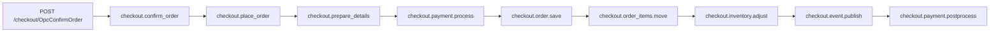

# Checkout Tracing Flow

```mermaid
flowchart LR
    A["POST /checkout/OpcConfirmOrder"] --> B["checkout.confirm_order"]
    B --> C["checkout.place_order"]
    C --> D["checkout.prepare_details"]
    D --> E["checkout.payment.process"]
    E --> F["checkout.order.save"]
    F --> G["checkout.order_items.move"]
    G --> H["checkout.inventory.adjust"]
    H --> I["checkout.event.publish"]
    I --> J["checkout.payment.postprocess"]
```
