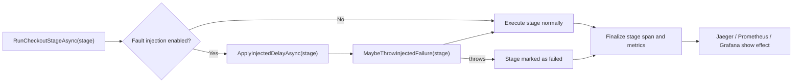

# Fault Injection Flow

```mermaid
flowchart LR
    A["RunCheckoutStageAsync(stage)"] --> B{"Fault injection enabled?"}
    B -->|No| E["Execute stage normally"]
    B -->|Yes| C["ApplyInjectedDelayAsync(stage)"]
    C --> D["MaybeThrowInjectedFailure(stage)"]
    D --> E
    D -->|throws| F["Stage marked as failed"]
    E --> G["Finalize stage span and metrics"]
    F --> G
    G --> H["Jaeger / Prometheus / Grafana show effect"]
```
