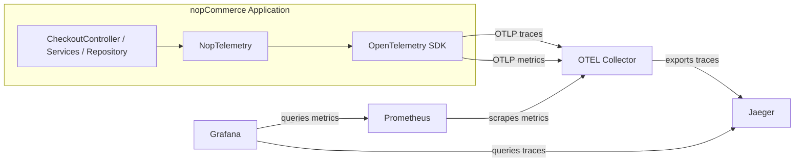

# Telemetry Pipeline

```mermaid
flowchart LR
    subgraph App["nopCommerce Application"]
        A["CheckoutController / Services / Repository"]
        B["NopTelemetry"]
        C["OpenTelemetry SDK"]
        A --> B
        B --> C
    end

    C -->|OTLP traces| D["OTEL Collector"]
    C -->|OTLP metrics| D
    D -->|exports traces| E["Jaeger"]
    F["Prometheus"] -->|scrapes metrics| D
    G["Grafana"] -->|queries traces| E
    G -->|queries metrics| F
```
